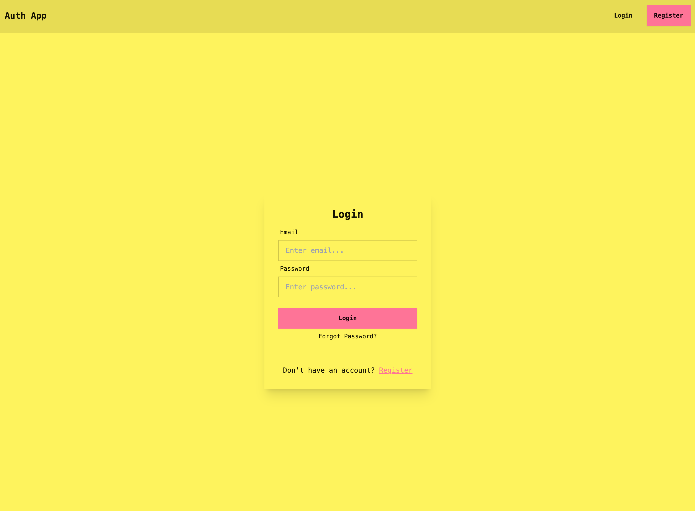

# MERN Stack Authentication Boilerplate

This is a full-stack web application built with the MERN stack (MongoDB, Express.js, React, Node.js) providing a complete, secure, and modern foundation for user authentication. The project features user registration, login, stateless session management using JWTs in `httpOnly` cookies, protected routes, and a dynamic UI that responds to the user's authentication state.
It serves as a robust starting point for any application requiring a secure user authentication system.



## Live Demo

You can try the App live, hosted on Render.com

👉 [**Click here to open the live demo!**](https://loginsignuppage-9ztx.onrender.com/)  

⚠️ Please note: 
Since the app is hosted on Render’s free tier, the server “sleeps” when inactive.
This means it may take up to 1–2 minutes for the application to fully start the first time you open it. Once it’s awake, it runs smoothly.

---

## Tech Stack

The project is architected with a clear separation between the backend server and the frontend client, utilizing the following technologies:

### Backend
* **Node.js**: JavaScript runtime environment for executing server-side code.
* **Express.js**: The framework used to build our web server and API, handling routing and middleware.
* **MongoDB & Mongoose**: A NoSQL database (managed via MongoDB Atlas) and an ODM library to simplify data modeling and interaction.
* **JSON Web Tokens (JWT)**: Used to create secure access tokens for stateless authentication and password reset flows.
* **bcrypt.js**: A library for hashing user passwords before storing them in the database.
* **Nodemailer**: A library for sending emails, used for the password reset functionality.
* **cookie-parser**: Middleware to parse cookies attached to the client request, essential for our auth flow.
* **CORS**: Middleware to enable Cross-Origin Resource Sharing between the client and server.
* **Dotenv**: Manages environment variables to keep sensitive information secure.
* **ES Modules (ESM)**: The project uses modern ES module syntax throughout for better compatibility and standardization.

### Frontend
* **React**: A JavaScript library for building dynamic and interactive user interfaces.
* **Vite**: A modern and extremely fast build tool for the frontend development experience.
* **React Router**: For handling client-side routing, enabling a Single-Page Application (SPA) experience.
* **Axios**: A promise-based HTTP client for seamless communication with the backend API.
* **React Context**: Used for global state management to track the user's authentication status across the application.
* **Tailwind CSS**: A utility-first CSS framework for rapid and responsive UI development.
* **DaisyUI**: A component library for Tailwind CSS providing pre-built and customizable UI components with "sunset" theme centrally managed.
* **lucid-react**: A library for clean and beautiful icons.
* **react-hot-toast**: For displaying user-friendly notifications and feedback.

---

## Core Features & Concepts

* **User Registration**: New users can sign up with a name, email, phone number, and password, with backend validation.
* **Secure User Login**: Registered users can log in, with password verification handled by `bcrypt.js`.
* **Password Reset Flow**: A complete, secure flow for users who have forgotten their password. It involves generating a unique, single-use, time-limited token and sending an email with reset instructions via Nodemailer.
* **Stateless Authentication**: The application uses JWTs stored in secure, `httpOnly` session cookies, a modern approach that protects against XSS attacks.
* **Protected Routes**: The application features a `protect` middleware on the backend to secure specific endpoints, ensuring they are only accessible to authenticated users.
* **Global State Management**: React Context provides a global state for the user, ensuring the UI instantly reacts to login and logout events without needing a page refresh.
* **Dynamic UI**: The navigation bar and other components change dynamically based on the user's authentication status.
* **Client-Side Routing (SPA)**: The application functions as a Single-Page Application, where page content is changed without full-page reloads. This is made possible by three key components from **React Router**:
    * **`<BrowserRouter>`**: Acts as the "brain," using the browser's History API to keep the UI and URL in sync.
    * **`<Link>`**: The "navigator" that intercepts clicks, prevents default page reloads, and updates the URL via the History API.
    * **`<Routes>` & `<Route>`**: The "content switcher" that listens for URL changes and renders the correct page component that matches the current path.

---

## Authentication Flow Explained

This application uses JWTs, transported via secure `httpOnly` cookies, to manage user sessions.

1.  **Login:** The user sends their email and password to the server.
2.  **Verification & Cookie Creation:** The server verifies the credentials. If correct, it creates a unique JWT and sets it inside a secure, `httpOnly` cookie that is sent back to the user's browser.
3.  **Browser Storage (Session Cookie):** The browser automatically stores the cookie. Since it's a session cookie, it is automatically deleted when the browser is closed. The `httpOnly` flag prevents any client-side JavaScript from accessing it.
4.  **Authenticated Requests:** For every future API request, the browser **automatically** attaches the cookie. The client-side code does not need to manually manage tokens.
5.  **Server Verification:** The server uses the `cookie-parser` middleware to read the token from the cookie and then verifies its signature. If valid, the server processes the request.

This system is highly efficient because the server does not need to store any session information. It fully trusts the digitally signed information contained within the securely transported token.

---

## Getting Started Locally

Follow these steps to clone and run the project on your local machine.

### Prerequisites
* Node.js (LTS version recommended)
* NPM (comes with Node.js)
* Git

### Installation Steps

1.  **Clone the repository:**
    ```bash
    git clone [https://github.com/SuecoAlto/Mern_Stack_Login_and_Signup_Page.git](https://github.com/SuecoAlto/Mern_Stack_Login_and_Signup_Page.git)
    cd Mern_Stack_Login_and_Signup_Page
    ```

2.  **Install Backend Dependencies:**
    ```bash
    cd Backend
    npm install
    ```

3.  **Install Frontend Dependencies:**
    ```bash
    cd ../Frontend
    npm install
    ```

4.  **Configure Environment Variables (Backend):**
    * Navigate to the `Backend` directory.
    * Create a file named `.env`.
    * Add the following variables. You will need to provide your own credentials for MongoDB Atlas and an email service (like Mailtrap for development).

        ```
        # Server Configuration
        PORT=5001

        # MongoDB
        MONGO_URI=your_mongodb_atlas_connection_string

        # JWT
        JWT_SECRET=your_super_secret_jwt_string

        # Frontend URL (for generating correct password reset links)
        FRONTEND_URL=http://localhost:5173

        # Email Service (e.g., Mailtrap for development)
        EMAIL_HOST=sandbox.smtp.mailtrap.io
        EMAIL_PORT=2525
        EMAIL_USER=your_mailtrap_username
        EMAIL_PASS=your_mailtrap_password
        EMAIL_FROM=noreply@yourapp.com
        ```
    * You can generate a strong secret key by running this command in your terminal:
        ```bash
        node -e "console.log(require('crypto').randomBytes(64).toString('hex'))"
        ```

5.  **Run the Application:**
    * **Start the Backend Server:** Open a terminal in the `Backend` directory and run:
        ```bash
        npm run dev
        ```
        The server will start on `http://localhost:5001`.

    * **Start the Frontend Client:** Open a *new* terminal in the `Frontend` directory and run:
        ```bash
        npm run dev
        ```
        The application will be available at `http://localhost:5173`.

---

## Development Journey & Key Troubleshooting Steps

During development, several common but educational issues were encountered and resolved.

* **Issue 1: `404 Not Found` on API Calls**
    * **Problem:** Initial API calls from the frontend failed with a 404 error.
    * **Diagnosis:** The Axios `baseURL` on the client was incorrectly pointing to the frontend's Vite server (`:5173`) instead of the backend's Express server (`:5000`).
    * **Solution:** The `axios.defaults.baseURL` in `main.jsx` was corrected to point to the proper backend address.

* **Issue 2: CORS Error with Cookies**
    * **Problem:** After fixing the `baseURL`, API calls were blocked by the browser due to CORS policy.
    * **Diagnosis:** A standard `cors()` configuration is insufficient when the frontend sends credentials (`withCredentials: true`). The server must explicitly trust the client's origin.
    * **Solution:** The CORS middleware on the server was updated to specify the frontend's origin and allow credentials.

* **Issue 3: `ERR_HTTP_HEADERS_SENT` Server Crash**
    * **Problem:** The backend server crashed whenever a request was made to a protected route.
    * **Diagnosis:** The `protect` middleware function was calling `next()` but did not stop its own execution, leading to an attempt to send two responses to a single request.
    * **Solution:** The logic in the `protect` middleware was refactored into a clear `if/else` block, ensuring only one response path is ever taken.

* **Issue 4: React Warning: "Controlled to Uncontrolled Input"**
    * **Problem:** A console warning appeared after a successful form submission.
    * **Diagnosis:** The form's state was being reset with an empty object (`setData({})`), causing the `value` prop of the inputs to change from an empty string (`''`) to `undefined`.
    * **Solution:** The state reset logic was corrected to reset the state to its original object structure, ensuring the inputs remained "controlled" by React.

* **Issue 5: Password Reset Email Links Pointing to Wrong URL**
    * **Problem:** When users clicked on password reset links in emails, they got 404 errors because the links pointed to the backend server (`localhost:5001`) instead of the frontend application.
    * **Diagnosis:** The `forgotPassword` controller was generating reset URLs using `req.protocol` and `req.get('host')`, which resolved to the backend server's address.
    * **Solution:** Updated the URL generation to use a `FRONTEND_URL` environment variable that points to the React application (`http://localhost:5173` in development), ensuring reset links correctly navigate users to the frontend reset password page.

* **Issue 6: CORS Preflight Request Failures for Password Reset**
    * **Problem:** `POST` requests to `/forgot-password` failed with CORS preflight errors, even though other endpoints worked.
    * **Diagnosis:** Complex requests (like `POST` with `application/json`) require explicit handling of `OPTIONS` preflight requests.
    * **Solution:** Added `app.options('*', cors(corsOptions))` to explicitly handle all preflight requests before other middleware, ensuring proper CORS headers are sent for all request types.
